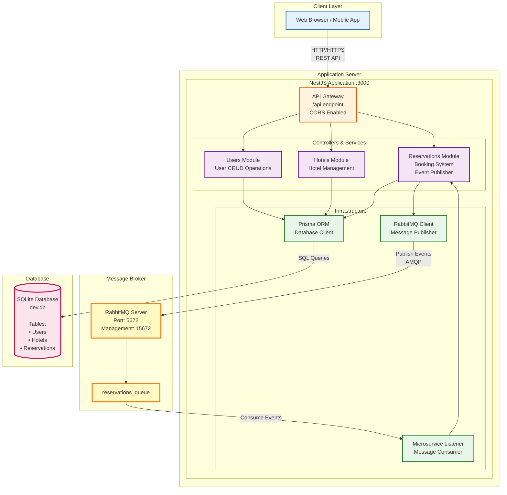

# Hotel Management System - Deployment Architecture

## System Deployment Diagram



## Architecture Overview

### Request Flow

#### Synchronous (REST API)
```
Client → API Gateway → Module (Users/Hotels/Reservations) → Prisma → SQLite → Response
```

#### Asynchronous (Event-Driven)
```
Reservation Created → RabbitMQ Client → Message Queue → Microservice Listener → Process Event
```

## Components

### 1. Client Layer
- Web browsers, mobile applications
- Communicates via REST API
- CORS enabled for cross-origin requests

### 2. NestJS Application (Port 3000)

#### API Gateway
- Global prefix: `/api`
- Handles all HTTP requests
- Routes to appropriate modules

#### Modules
| Module | Responsibility | Database Access |
|--------|----------------|-----------------|
| **Users** | User registration, profile management | Users table |
| **Hotels** | Hotel registration, search, management | Hotels table |
| **Reservations** | Booking creation, management, events | Reservations table |

#### Infrastructure
- **Prisma ORM**: Type-safe database queries, schema management
- **RabbitMQ Client**: Publishes events to message queue
- **Microservice Listener**: Consumes messages from queue for async processing

### 3. RabbitMQ (Ports 5672, 15672)
- Message broker for asynchronous communication
- Queue: `reservations_queue` (durable: false)
- Protocol: AMQP
- Management UI available on port 15672

### 4. SQLite Database
- File-based database: `prisma/dev.db`
- Schema managed by Prisma migrations

**Database Schema:**
```
User (id, name, email, number, createdAt)
  ↓ 1:N
Reservation (id, customerName, phone, location, mail, date, userId, hotelId)
  ↓ N:1
Hotel (id, hotelName, location)
```

## Technology Stack

```
├─ Runtime: Node.js
├─ Framework: NestJS 11.x
├─ Database: SQLite
├─ ORM: Prisma 5.22.x
├─ Message Broker: RabbitMQ 3.x
├─ Protocol: AMQP, HTTP
└─ Language: TypeScript
```

## Deployment

### Development Setup
```bash
# 1. Start RabbitMQ container
docker run -d --name rabbitmq \
  -p 5672:5672 \
  -p 15672:15672 \
  rabbitmq:3-management

# 2. Install dependencies
npm install

# 3. Generate Prisma client
npx prisma generate

# 4. Run database migrations (if any)
npx prisma migrate dev

# 5. Start application
npm run start:dev
```

### Production Deployment
```bash
# Build application
npm run build

# Start production server
npm run start:prod
```

## Environment Configuration

Create `.env` file:
```env
DATABASE_URL="file:./dev.db"
PORT=3000
```

## Network Endpoints

| Service | Port | Protocol | Access |
|---------|------|----------|--------|
| API Gateway | 3000 | HTTP | `http://localhost:3000/api` |
| RabbitMQ Broker | 5672 | AMQP | `amqp://localhost:5672` |
| RabbitMQ Management | 15672 | HTTP | `http://localhost:15672` |

## API Endpoints Structure

```
http://localhost:3000/api
├─ /users
│  ├─ GET    /           # List all users
│  ├─ GET    /:id        # Get user by ID
│  ├─ POST   /           # Create user
│  ├─ PATCH  /:id        # Update user
│  └─ DELETE /:id        # Delete user
├─ /hotels
│  ├─ GET    /           # List all hotels
│  ├─ GET    /:id        # Get hotel by ID
│  ├─ POST   /           # Create hotel
│  ├─ PATCH  /:id        # Update hotel
│  └─ DELETE /:id        # Delete hotel
└─ /reservations
   ├─ GET    /           # List all reservations
   ├─ GET    /:id        # Get reservation by ID
   ├─ POST   /           # Create reservation (triggers RabbitMQ event)
   ├─ PATCH  /:id        # Update reservation
   └─ DELETE /:id        # Delete reservation
```

## Production Recommendations

### Database
- Replace SQLite with PostgreSQL or MySQL
- Implement connection pooling
- Set up database backups

### Message Queue
- Use managed RabbitMQ service (CloudAMQP, AWS MQ)
- Enable authentication and SSL
- Configure queue durability and persistence

### Application
- Use process manager (PM2) for Node.js
- Implement health checks
- Set up logging and monitoring
- Add authentication/authorization
- Use environment-specific configurations

### Infrastructure
- Deploy behind load balancer
- Use container orchestration (Docker + Kubernetes)
- Implement auto-scaling
- Set up CI/CD pipeline

---

**Project**: Hotel Management System
**Framework**: NestJS + Prisma + RabbitMQ
**Architecture**: Microservices with Event-Driven Communication
